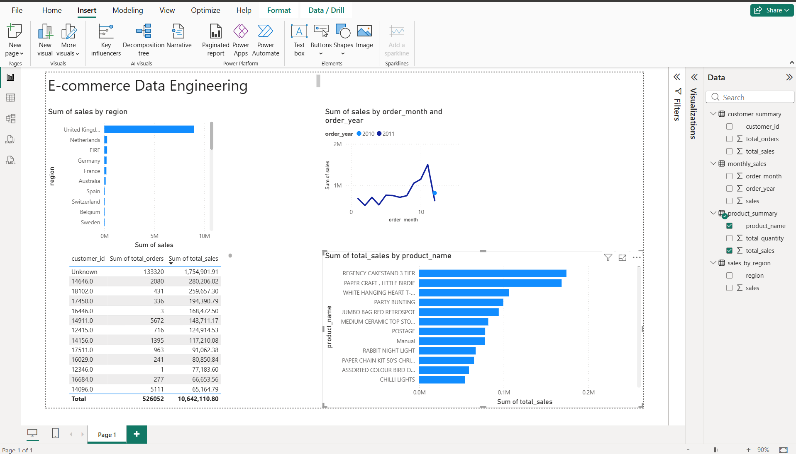

# E-commerce Data Engineering Pipeline

## Dashboard

## Project Overview
Built an end-to-end data engineering pipeline using Python, SQL, SQLite, and Power BI to process 500K+ online retail transactions.

## Tech Stack
Python, Pandas, SQL, SQLite, SQLAlchemy, Power BI, GitHub

## Pipeline Workflow
1. Loaded raw Excel retail transaction data
2. Cleaned and standardized column names
3. Removed duplicates, returns, and invalid rows
4. Created sales metrics and date fields
5. Validated data quality
6. Built transformed summary tables
7. Loaded outputs into SQLite
8. Ran SQL analysis
9. Built Power BI dashboard

## Key Outputs
- Cleaned transaction data
- Validation report
- Sales by region
- Monthly revenue trends
- Customer summary
- Product summary
- SQL insights
- Power BI dashboard

## Business Insights
- Identified top-performing countries by revenue
- Analyzed monthly revenue trends
- Ranked top customers by sales
- Identified highest-revenue products

## Resume Impact
This project demonstrates ETL development, data cleaning, validation, SQL analysis, database loading, and dashboarding.